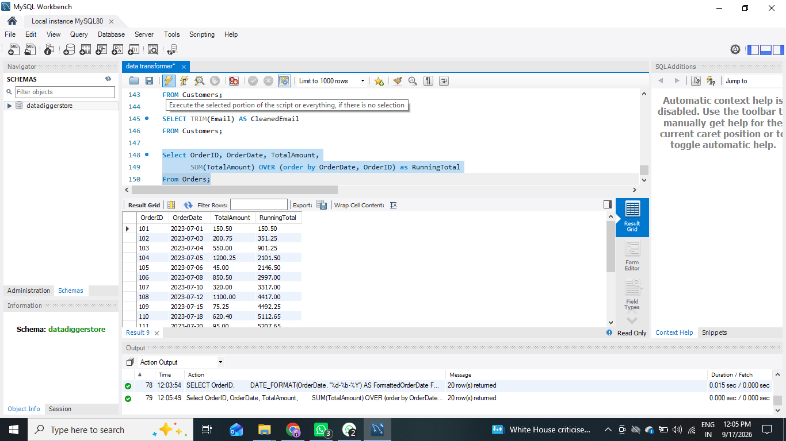
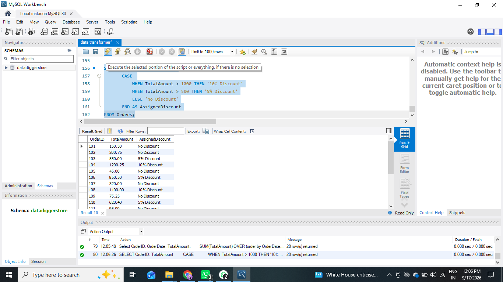

# Data Transformer 

## Project Overview
**Data Transformer** is a comprehensive SQL project designed to enhance practical knowledge of advanced SQL operations. The project simulates a Corporate Data Analysis System containing three core tables: `Customers`, `Orders`, and `Employees`, structured to practice Joins, Subqueries, Date and String Manipulation Functions, Window Functions, and SQL CASE Expressions.

---

## Project Objectives
By completing this project, students build the skills needed to:
- Transform and manipulate relational data for reporting and analysis.
- Execute complex multi-table joins (Inner, Left, Right, Full Outer simulation).
- Implement subqueries for dynamic data filtering.
- Apply window functions (`SUM() OVER`, `RANK() OVER`) for analytical insights.
- Format dates, strings, and use conditional expressions.

---

## Database Schema & Structure

### 1. Customers Table
Stores customer registration and personal information.
- **CustomerID** (INT, Primary Key)
- **FirstName** (VARCHAR)
- **LastName** (VARCHAR)
- **Email** (VARCHAR)
- **RegistrationDate** (DATE)

### 2. Orders Table
Tracks customer purchase orders and transaction amounts.
- **OrderID** (INT, Primary Key)
- **CustomerID** (INT, Foreign Key referencing `Customers`)
- **OrderDate** (DATE)
- **TotalAmount** (DECIMAL)

### 3. Employees Table
Manages employee records, departments, hiring info, and salaries.
- **EmployeeID** (INT, Primary Key)
- **FirstName** (VARCHAR)
- **LastName** (VARCHAR)
- **Department** (VARCHAR)
- **HireDate** (DATE)
- **Salary** (DECIMAL)

---

## Complete Queries to Perform

### 1. INNER JOIN
Retrieves all orders and customer details where orders exist.
```sql
SELECT c.CustomerID, c.FirstName, c.LastName, c.Email, c.RegistrationDate, 
       o.OrderID, o.OrderDate, o.TotalAmount
FROM Customers c
INNER JOIN Orders o ON c.CustomerID = o.CustomerID;
```


### 2. LEFT JOIN
Retrieves all customers and their corresponding orders (if any).
```sql
SELECT c.CustomerID, c.FirstName, c.LastName, c.Email, c.RegistrationDate, 
       o.OrderID, o.OrderDate, o.TotalAmount
FROM Customers c
LEFT JOIN Orders o ON c.CustomerID = o.CustomerID;
```

### 3. RIGHT JOIN
Retrieves all orders and their corresponding customers (if any).
```sql
SELECT c.CustomerID, c.FirstName, c.LastName, c.Email, c.RegistrationDate, 
       o.OrderID, o.OrderDate, o.TotalAmount
FROM Customers c
RIGHT JOIN Orders o ON c.CustomerID = o.CustomerID;
```


### 4. FULL OUTER JOIN (MySQL Workaround using UNION)
Retrieves all customers and all orders, regardless of matching.
```sql
SELECT c.CustomerID, c.FirstName, c.LastName, c.Email, c.RegistrationDate, 
       o.OrderID, o.OrderDate, o.TotalAmount
FROM Customers c
LEFT JOIN Orders o ON c.CustomerID = o.CustomerID

UNION

SELECT c.CustomerID, c.FirstName, c.LastName, c.Email, c.RegistrationDate, 
       o.OrderID, o.OrderDate, o.TotalAmount
FROM Customers c
RIGHT JOIN Orders o ON c.CustomerID = o.CustomerID;
```

### 5. Subquery (Orders > Average Amount)
Finds customers who have placed orders worth more than the average amount.
```sql
SELECT DISTINCT c.CustomerID, c.FirstName, c.LastName, o.TotalAmount
FROM Customers c
JOIN Orders o ON c.CustomerID = o.CustomerID
WHERE o.TotalAmount > (SELECT AVG(TotalAmount) FROM Orders);
```

### 6. Subquery (Employees > Average Salary)
Finds employees with salaries above the average salary.
```sql
SELECT EmployeeID, FirstName, LastName, Department, HireDate, Salary
FROM Employees
WHERE Salary > (SELECT AVG(Salary) FROM Employees);
```


### 7. Extract Year and Month
Extracts the year and month from the OrderDate.
```sql
SELECT OrderID, 
       YEAR(OrderDate) AS OrderYear, 
       MONTH(OrderDate) AS OrderMonth
FROM Orders;
```

### 8. Date Difference
Calculates the difference in days between two dates.
```sql
SELECT OrderID, OrderDate, 
       DATEDIFF(CURRENT_DATE, OrderDate) AS DaysDifference
FROM Orders;
```

### 9. Date Formatting
Formats the OrderDate to a more readable format.
```sql
SELECT OrderID, 
       DATE_FORMAT(OrderDate, '%d-%b-%Y') AS FormattedOrderDate
FROM Orders;
```


### 10. String Concatenation
Concatenates FirstName and LastName to form a full name.
```sql
SELECT CONCAT(FirstName, ' ', LastName) AS FullName
FROM Customers;
```

### 11. String Replacement
Replaces a specific text pattern inside a string.
```sql
SELECT REPLACE(FirstName, 'John', 'Jonathan') AS UpdatedFirstName
FROM Customers;
```

### 12. Uppercase and Lowercase Conversion
Converts name cases.
```sql
SELECT UPPER(FirstName) AS UpperFirstName, 
       LOWER(LastName) AS LowerLastName
FROM Customers;
```

### 13. Trim Extra Spaces
Cleans whitespace from fields.
```sql
SELECT TRIM(Email) AS CleanedEmail
FROM Customers;
```

### 14. Running Total
Calculates running total of transactions using window functions.
```sql
SELECT OrderID, OrderDate, TotalAmount,
       SUM(TotalAmount) OVER (ORDER BY OrderDate, OrderID) AS RunningTotal
FROM Orders;
```


### 15. Ranking Orders
Ranks orders based on total transaction amount.
```sql
SELECT OrderID, CustomerID, TotalAmount,
       RANK() OVER (ORDER BY TotalAmount DESC) AS OrderRank
FROM Orders;
```

### 16. Conditional Discount (CASE Expression)
Assigns dynamic discount tiers based on order values.
```sql
SELECT OrderID, TotalAmount,
       CASE 
           WHEN TotalAmount > 1000 THEN '10% Discount'
           WHEN TotalAmount > 500 THEN '5% Discount'
           ELSE 'No Discount'
       END AS AssignedDiscount
FROM Orders;
```


### 17. Categorize Employee Salaries
Categorizes employee salaries into tiers.
```sql
SELECT EmployeeID, FirstName, LastName, Salary,
       CASE 
           WHEN Salary > 75000 THEN 'High'
           WHEN Salary BETWEEN 50000 AND 75000 THEN 'Medium'
           ELSE 'Low'
       END AS SalaryCategory
FROM Employees;
```

---

## Setup & Execution Instructions
1. Open MySQL Workbench and create the database:
   ```sql
   CREATE DATABASE DataTransformerDB;
   USE DataTransformerDB;
   ```
2. Execute the table creation statements for `Customers`, `Employees`, and `Orders`.
3. Insert the 20 rows of sample test data for each table.
4. Execute and test individual analytical queries.
